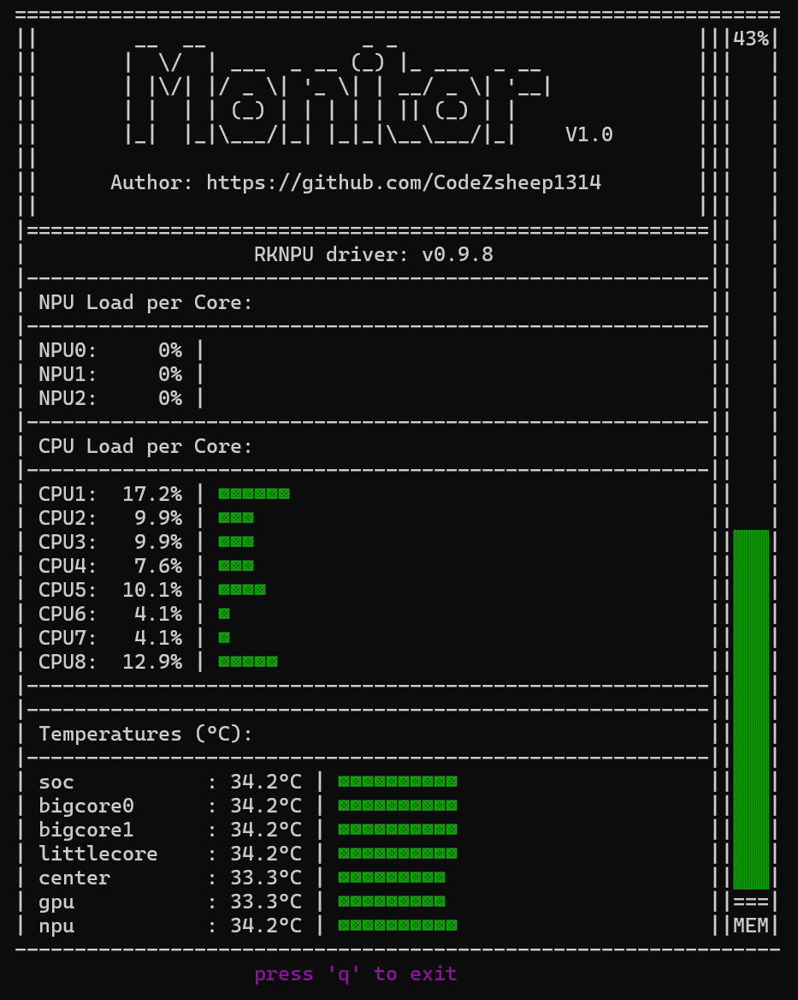

# rk3588-monitor

> RK3588 / Linux 嵌入式开发板 **NPU · CPU · 温度 · 内存** 实时负载监控工具 — 终端模式 (curses 进度条)

在终端内实时可视化瑞芯微 RK3588 芯片的运行状态，**无需 GUI / 无需 X Server**，可远程 SSH 使用。

  

---

## 目录

- [功能特性](#功能特性)
- [效果预览](#效果预览)
- [部署要求](#部署要求)
- [快速开始](#快速开始)
- [使用方法](#使用方法)
- [数据源说明](#数据源说明)
- [终端与可视化说明](#终端与可视化说明)
- [常见问题](#常见问题)
- [项目结构](#项目结构)
- [许可证](#许可证)

---

## 功能特性

| 模块 | 内容 | 数据源 |
|------|------|--------|
| **NPU 负载** | 3 个 NPU 核心的实时占用率 (Core0/1/2) | `/sys/kernel/debug/rknpu/load` |
| **NPU 驱动版本** | 当前加载的 RKNPU 驱动版本号 | `/sys/kernel/debug/rknpu/version` |
| **CPU 负载** | 8 个 CPU 核心的实时占用率 | `psutil.cpu_percent(percpu=True)` |
| **内存占用** | 系统总内存使用率 (右侧竖条进度条) | `psutil.virtual_memory()` |
| **温度** | 所有 `thermal_zone*` 区的温度 (°C, 1 位小数) | `/sys/class/thermal/thermal_zone*/temp` |

### 其它特性
- **三段式颜色阈值**：`<40%` 绿、`40-60%` 黄、`≥60%` 红
- **对齐严格**：所有横向进度条起止列对齐；标签统一 16 字符宽度
- **自适应布局**：内存竖条高度随温度区行数自动延长
- **零依赖污染**：用 `uv` 管理依赖，不污染全局 Python 环境
- **低开销**：基于 `curses`，每 1 秒刷新一次

---

## 效果预览



> 注: 内存竖条的填充块 `▓▓▓` 与 `|` 边框使用三段式颜色阈值 (`<40%` 绿 / `40-60%` 黄 / `≥60%` 红), 高度根据温度区行数自动延长, 始终与温度区底边对齐.

---

## 部署要求

| 项目 | 要求 | 备注 |
|------|------|------|
| 硬件 | RK3588 (Firefly / Rock 5B / Orange Pi 5 等) 或任意 Linux | NPU 模块仅 RK3588 有数据 |
| 系统 | Linux (Debian 10+ / Ubuntu 20.04+ / Armbian) | 需暴露 `/sys/class/thermal/` |
| Python | ≥ 3.10 | `python3 --version` 检查 |
| 工具 | [uv](https://github.com/astral-sh/uv) ≥ 0.4 | 自动管理 Python 依赖 |
| 权限 | `sudo` (无需密码更佳) | 读取 NPU 调试节点需要 root |
| 终端 | 宽度 **≥ 67 列**，高度 **≥ 30 行** | 否则可能显示不全 |

> **关于 uv**：一个用 Rust 写的极速 Python 包管理器，5 秒搞定依赖安装。本项目用其 [PEP 723 inline script metadata](https://peps.python.org/pep-0723/) 能力，依赖写在 `watchload.py` 文件头里，无需 `requirements.txt`。

---

## 快速开始

### 1. 克隆项目

```bash
git clone https://github.com/<your-account>/watchload-for-rk3588.git
cd watchload-for-rk3588
```

### 2. 安装 uv (若系统未装)

```bash
# 官方一键安装 (Linux/macOS)
curl -LsSf https://astral.sh/uv/install.sh | sh

# 或 apt (Debian/Ubuntu)
sudo apt install -y uv
```

> 安装后需重新登录 shell，或 `source ~/.bashrc` / `source ~/.local/bin/env`，让 `uv` 出现在 `PATH` 里。

### 3. 配置 sudo 免密 (可选，但强烈推荐)

`watchload` 用 `sudo cat /sys/kernel/debug/rknpu/load` 读 NPU 负载。频繁 sudo 输密码体验差：

```bash
sudo visudo -f /etc/sudoers.d/watchload
```

加入这一行 (把 `firefly` 替换为你的用户名)：

```
firefly ALL=(ALL) NOPASSWD: /usr/bin/cat /sys/kernel/debug/rknpu/load
firefly ALL=(ALL) NOPASSWD: /usr/bin/cat /sys/kernel/debug/rknpu/version
```

### 4. 启动

```bash
# 方式 A：用仓库自带的启动脚本
chmod +x ./watchload
./watchload

# 方式 B：直接用 uv 跑 (uv 会按文件头声明的依赖自动装环境)
uv run watchload.py -m t

# 方式 C：手动 python3 跑 (需先 `uv pip install --system psutil`)
python3 watchload.py -m t
```

**首次运行** `uv run` 会自动创建虚拟环境并安装 `psutil` / `argparse`，约 5~10 秒。之后秒开。

### 5. 退出

按 **`q`** 键。

---

## 使用方法

```text
watchload                   # 启动终端模式 (默认)
watchload -t                # 显式指定终端模式
watchload -h, --help        # 显示帮助
```

直接运行 `python3 watchload.py` 不带参数时，默认进入终端模式 (因为 `-m` 的默认值是 `t`)。

### 在脚本内调用

```bash
# 后台跑 60 秒, 抓取一次状态快照
timeout 60 ./watchload > /tmp/watchload.log
# 终端刷新内容是 ANSI 转义序列, 不便于重定向, 推荐用 tmux/screen 录屏
```

### 在 tmux / screen 里跑

```bash
tmux new -s watch './watchload'
# 离开: Ctrl+B 再按 d
# 回来: tmux attach -t watch
```

这样关掉 SSH 也能继续监控。

---

## 数据源说明

### NPU 负载

```
$ sudo cat /sys/kernel/debug/rknpu/load
NPU load:  Core0: 45%  Core1: 32%  Core2: 78%
```

如果输出格式不同 (不同驱动版本)，正则 `r'Core\d+: *(\d+)%'` 会匹配失败，脚本会安全地显示 0%。

### 温度

```bash
$ ls /sys/class/thermal/thermal_zone*/
/sys/class/thermal/thermal_zone0  ...  thermal_zone6

$ cat /sys/class/thermal/thermal_zone0/type
soc-thermal
$ cat /sys/class/thermal/thermal_zone0/temp
45000        # 单位: 毫°C, 脚本里会除以 1000 显示
```

脚本会按字典序遍历所有 `thermal_zone*`，去掉 `-thermal` 后缀作为短名 (例如 `soc-thermal` → `soc`)。

### CPU / 内存

由 `psutil` 提供，无需额外配置。

---

## 终端与可视化说明

### 颜色阈值

| 负载区间 | 颜色 | 适用场景 |
|----------|------|---------|
| `< 40%`  | 🟢 绿 | 空闲 / 轻载 |
| `40% ~ 60%` | 🟡 黄 | 正常负载 |
| `≥ 60%`  | 🔴 红 | 高负载 / 满载 |

提示文字 (例如 `press 'q' to exit`) 用洋红显示。

### 终端宽度要求

脚本每行最长 67 字符 (含外框 `|`)。低于此宽度会导致行被截断。

```bash
# 临时加宽 (在 screen / tmux 里也能调)
resize -s 30 80
```

### 字体依赖

进度条使用 Unicode 块字符 `▩` (U+25A9) 和 `▓` (U+2593)。绝大多数现代终端 (包括 Windows Terminal、iTerm2、Linux GNOME Terminal) 原生支持。若显示为方块或问号，请检查：

```bash
echo -e "\u25a9 \u2593"   # 应输出 ▩ ▓
locale                    # 应包含 UTF-8
```

---

## 常见问题

### Q1: `sudo: cat: command not found` 或 `密码要求`

说明 sudo 没配免密，按 [步骤 3](#3-配置-sudo-免密-可选但强烈推荐) 配置。临时方案：让 root 跑：

```bash
sudo -E env PATH=$PATH uv run $(pwd)/watchload.py -m t
```

### Q2: 启动后画面是乱码 / 方块

终端不是 UTF-8。修复：

```bash
export LANG=C.UTF-8
export LC_ALL=C.UTF-8
./watchload
```

或直接在 `~/.bashrc` 里写死。

### Q3: 提示 "window size is insufficient"

终端高度不够 (需要 ≥ 30 行)。最大化终端窗口即可。

### Q4: 温度区全为 0

可能板子没接温控子系统，或 `/sys/class/thermal/` 为空。检查：

```bash
ls /sys/class/thermal/ | head
```

若空，需在内核配置中开启 `CONFIG_THERMAL=y` 与 `CONFIG_THERMAL_HWMON=y`。

### Q5: NPU 负载一直显示 0

`/sys/kernel/debug/rknpu/load` 不存在，多见于 RKNPU 驱动未加载：

```bash
lsmod | grep rknpu
sudo modprobe rknpu            # 或重新装驱动
```

### Q6: 想同时跑多个实例

`curses` 是独占终端的，多个实例会冲突。推荐用 `tmux` 开多个 pane：

```bash
tmux new-session -d -s wl './watchload' \; split-window -h './watchload'
```

---

## 项目结构

```
watchload-for-rk3588/
├── watchload          # Bash 启动脚本 (封装 uv run)
├── watchload.py       # 主程序 (含 PEP 723 inline 依赖声明)
├── README.md          # 本文档
└── __pycache__/       # Python 字节码缓存 (git 应忽略)
```

代码结构 (自上而下)：

| 函数 | 作用 |
|------|------|
| `get_npu_load()` | 解析 NPU 三个核心的负载百分比 |
| `get_cpu_load()` | 用 psutil 读 8 个核心 |
| `get_npudriver_version()` | 解析 `/sys/kernel/debug/rknpu/version` |
| `get_memory_usage()` | 用 psutil 读总内存占用率 |
| `get_temperatures()` | 遍历所有 `thermal_zone*` 读温度 |
| `draw_bar()` | 通用横向进度条绘制 (含对齐) |
| `draw_bar_vertical()` | 内存竖条绘制 |
| `draw_logo()` | 顶部 logo |
| `terminalShow()` | curses 主循环入口 |

---

## 路线图

- [x] NPU / CPU 负载
- [x] 温度
- [x] 内存竖条
- [x] 颜色阈值
- [x] 对齐 / 自适应布局
- [ ] 导出 CSV 历史数据
- [ ] 报警阈值 (温度过高闪红)
- [ ] 支持非 RK3588 平台 (纯 CPU/温度)

---

## 许可证

MIT License © CodeZsheep1314

## 致谢

- [uv](https://github.com/astral-sh/uv) — 极简 Python 依赖管理
- [curses](https://docs.python.org/3/library/curses.html) — Python 内置终端 UI 库
- [psutil](https://github.com/giampaolo/psutil) — 跨平台系统信息库
